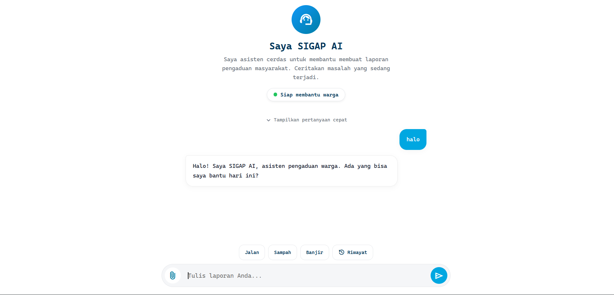

# SIGAP Kota

Proyek Ujian Akhir Semester mata kuliah Generative AI. SIGAP Kota adalah chatbot pengaduan warga untuk layanan smart city. Warga bisa melaporkan masalah di sekitar mereka seperti jalan rusak, sampah menumpuk, atau banjir, dan petugas dapat memantau serta menindaklanjuti laporan tersebut melalui dashboard admin.

Ada dua sisi pengguna: warga mengakses `index.html` untuk berinteraksi dengan chatbot, sementara admin membuka `admin.html` untuk melihat dan mengelola laporan yang masuk. Halaman warga tidak menyertakan tautan ke halaman admin. Akses admin hanya bisa dilakukan lewat URL langsung, sekadar untuk mensimulasikan pemisahan hak akses, bukan sistem keamanan sesungguhnya.



## Cara Kerja

Chatbot tidak langsung menerima laporan secara mentah. Sebelum sebuah laporan dianggap lengkap, sistem akan menanyakan lima hal secara bertahap: jenis masalah, lokasi kejadian, kondisi atau tingkat keparahannya, waktu kejadian, dan nomor HP untuk keperluan kontak. Setelah kelima data tersebut terkumpul, AI akan mengklasifikasikan laporan dengan menentukan kategori, prioritas, dan instansi yang relevan, lalu menampilkan ringkasan kepada warga sebelum laporan dikirim.

Warga dapat memantau status laporannya sendiri melalui tab Riwayat dengan memasukkan nomor HP yang sama saat melapor. Di sisi lain, petugas dapat login ke dashboard admin untuk melihat seluruh laporan yang masuk dan memperbarui statusnya menjadi "Diproses" atau "Selesai".

## Instalasi dan Menjalankan Proyek

Backend proyek ini menggunakan Express, SQLite sebagai database lokal, dan Gemini API untuk kecerdasan buatannya. Untuk memulai, install dependency-nya terlebih dahulu:

```
npm install
```

Buat file `.env` di root proyek dengan isi berikut:
```
GEMINI_API_KEY=isi_dengan_api_key_gemini_anda
PORT=3000
```

API key Gemini dapat diperoleh secara gratis di https://aistudio.google.com/apikey.

Setelah itu, jalankan backend dengan:
```
npm run dev
```

Untuk frontend, buka melalui server lokal, bukan dengan membuka file secara langsung di browser. Cara termudah adalah menggunakan ekstensi Live Server di VSCode. Klik kanan pada `Frontend/index.html`, lalu pilih *Open with Live Server*. Alternatifnya, jika Python sudah terpasang, jalankan `python -m http.server 5500` dari dalam folder Frontend, lalu akses melalui `localhost:5500/index.html`.

## Login Admin (Demo)

```
Username: petugas
Password: 123456
```

Kredensial ini masih hardcoded di dalam kode dan hanya digunakan untuk keperluan demonstrasi, bukan sistem autentikasi yang sesungguhnya.

## Keterbatasan

Proyek ini belum memiliki sistem autentikasi yang sebenarnya, baik untuk admin maupun warga. Database yang digunakan masih berupa SQLite lokal dan belum terhubung ke layanan cloud. Selain itu, Gemini API terkadang mengalami keterbatasan kapasitas (error 503) saat trafik permintaan sedang tinggi di sisi Google. Untuk kasus ini, backend sudah menyediakan pesan error yang informatif bagi pengguna, alih-alih menampilkan error mentah.